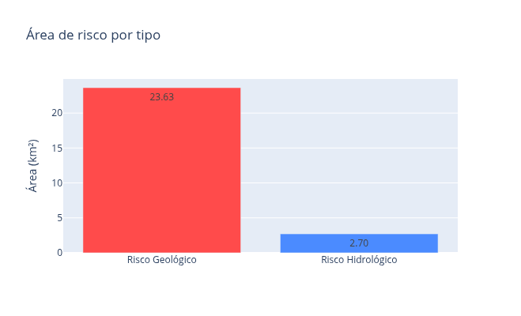
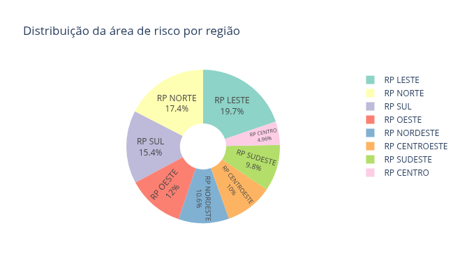
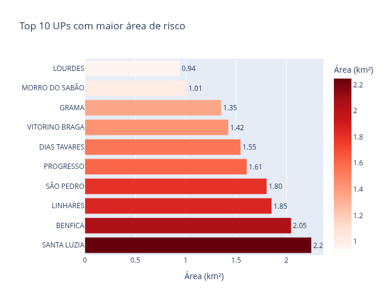
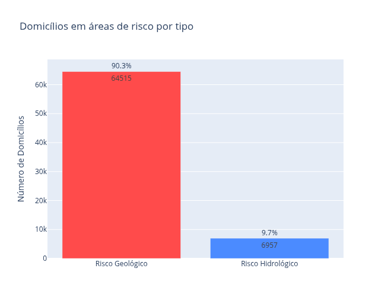
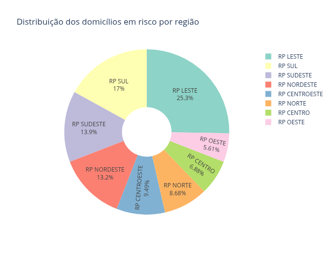
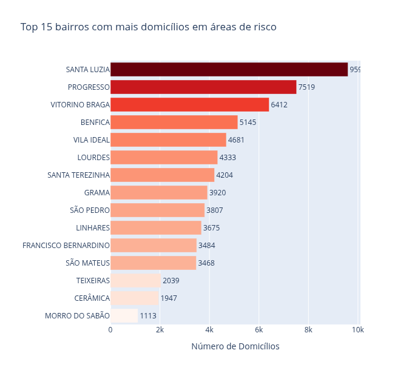
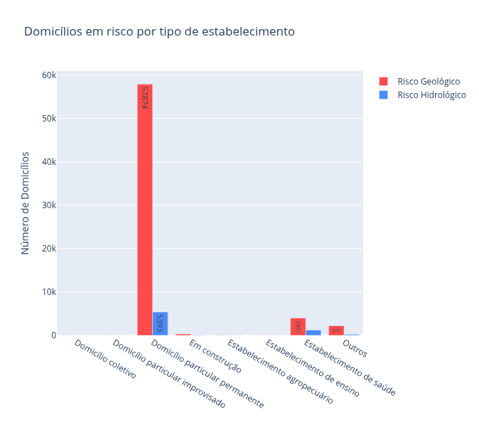

# Domicílios em áreas de risco em Juiz de Fora

### Introdução

No projeto anterior, disponível [aqui](https://github.com/guiajf/riscojf), compartilhamos o passo a passo para converter um mapa criado no *Google My Maps* para um mapa interativo personalizado, com uso de *Folium* e outras bibliotecas do Python. Então, o foco era a visualização cartográfica das áreas de risco mapeadas pela **Defesa Civil** do município.

Agora, avançamos para uma etapa complementar e igualmente importante: em vez de nos determos apenas na visualização espacial, produzimos tabelas e gráficos para uma análise quantitativa detalhada. Esta análise abrange tanto a extensão territorial das áreas de risco (por **Unidade** e **Região de Planejamento**) quanto a quantificação dos domicílios situados nessas áreas, com base nos dados do **Censo 2022**.

### Objetivo

Realizar uma análise quantitativa das áreas de risco do município de Juiz de Fora, segmentada por **Unidade de Planejamento (UP)** e **Região de Planejamento (RP)**, utilizando como base o mapeamento de risco elaborado pela **Defesa Civil**. Complementarmente, a partir dos microdados do **Censo Demográfico 2022** (**CNEFE** - *Cadastro Nacional de Endereços para Fins Estatísticos*), quantificar e caracterizar os imóveis afetados, identificando sua distribuição espacial e tipologia.

### Importamos as bibliotecas


```python
import geopandas as gpd
import pandas as pd
import numpy as np
import fiona
import geobr

import os
import zipfile
from tqdm import tqdm

from shapely.geometry import Point
import warnings
warnings.filterwarnings('ignore')

import plotly.express as px
import plotly.graph_objects as go
from plotly.subplots import make_subplots
```

### Carregamos os dados

**Obtemos os dados de risco**


```python
camadas = fiona.listlayers("mapa_risco_jf.kml")
gdfs = []
for layer in camadas:
    gdf = gpd.read_file("mapa_risco_jf.kml", layer=layer)
    gdf['camada_origem'] = layer
    gdfs.append(gdf)
gdf_risco_original = pd.concat(gdfs, ignore_index=True)
print(f"Total de feições de risco carregadas: {len(gdf_risco_original)}")
```

    Total de feições de risco carregadas: 1172


**Definimos os limites do município**


```python
jf = geobr.read_municipality(code_muni=3136702, year=2020)
```

**Extraímos o shapefile das Unidades e Regiões de Planejamento**

Os shapefiles estão disponíveis em: https://www.pjf.mg.gov.br/desenvolvimentodoterritorio/plano_diretor/apresentacao.php.


```python
def extrair_e_carregar(arquivo_zip, pasta_destino):
    """Extrai ZIP e carrega shapefile"""
    os.makedirs(pasta_destino, exist_ok=True)
    with zipfile.ZipFile(arquivo_zip, 'r') as zip_ref:
        arquivos = [f for f in zip_ref.namelist() if f.endswith(('.shp', '.shx', '.dbf', '.prj'))]
        for arquivo in tqdm(arquivos, desc=f"Extraindo {os.path.basename(arquivo_zip)}"):
            zip_ref.extract(arquivo, pasta_destino)
    shp_files = [f for f in os.listdir(pasta_destino) if f.endswith('.shp')]
    if shp_files:
        caminho_shp = os.path.join(pasta_destino, shp_files[0])
        gdf = gpd.read_file(caminho_shp)
        return gdf.to_crs(epsg=4326)
    return None

print("\nExtraindo shapefiles...")
if os.path.exists("upjf_shp.zip"):
    gdf_up = extrair_e_carregar("upjf_shp.zip", "dados_jf/up")
    print(f"UP carregada: {len(gdf_up)} unidades")
else:
    print("Arquivo upjf_shp.zip não encontrado")
    gdf_up = None

if os.path.exists("rpjf_shp.zip"):
    gdf_rp = extrair_e_carregar("rpjf_shp.zip", "dados_jf/rp")
    print(f"RP carregada: {len(gdf_rp)} regiões")
else:
    print("Arquivo rpjf_shp.zip não encontrado")
    gdf_rp = None

```

    
    Extraindo shapefiles...


    Extraindo upjf_shp.zip: 100%|█████████████████████| 4/4 [00:00<00:00, 17.15it/s]


    UP carregada: 38 unidades


    Extraindo rpjf_shp.zip: 100%|████████████████████| 4/4 [00:00<00:00, 138.33it/s]


    RP carregada: 8 regiões


**Obtemos os dados do Censo 2022 (domicílios)**


```python
print("\n" + "="*60)
print("CARREGANDO DADOS DO CENSO 2022")
print("="*60)

try:
    with zipfile.ZipFile('domicilios_jf.zip') as z:
        with z.open('3136702_JUIZ_DE_FORA.csv') as f:
            chunks = pd.read_csv(f, sep=';', chunksize=10000, encoding='latin1', 
                                  usecols=['COD_ESPECIE', 'DSC_ESTABELECIMENTO', 'LATITUDE', 'LONGITUDE'])
            domicilios_list = []
            for chunk in chunks:
                # Filtra apenas códigos de domicílios (1-8)
                domicilios_list.append(chunk[chunk['COD_ESPECIE'].isin(range(1,9))])
            df_domicilios = pd.concat(domicilios_list, ignore_index=True)
    
    print(f"Total de registros de domicílios: {len(df_domicilios)}")
    
    # Limpeza e criação do GeoDataFrame de domicílios
    df_domicilios = df_domicilios.dropna(subset=['LATITUDE', 'LONGITUDE'])
    df_domicilios = df_domicilios[(df_domicilios['LATITUDE'] != 0) & (df_domicilios['LONGITUDE'] != 0)]
    geometry = [Point(xy) for xy in zip(df_domicilios['LONGITUDE'], df_domicilios['LATITUDE'])]
    gdf_domicilios = gpd.GeoDataFrame(df_domicilios, geometry=geometry, crs="EPSG:4326")
    print(f"GeoDataFrame de domicílios criado com {len(gdf_domicilios)} pontos válidos.")
except Exception as e:
    print(f"Erro ao carregar dados do Censo: {e}")
    gdf_domicilios = None
```

    
    ============================================================
    CARREGANDO DADOS DO CENSO 2022
    ============================================================
    Total de registros de domicílios: 307905
    GeoDataFrame de domicílios criado com 307905 pontos válidos.


### Analisamos a extensão das áreas de risco


```python
# ===========================================
# ANÁLISE 1: EXTENSÃO DAS ÁREAS DE RISCO
# ===========================================

def analise_risco_completa(gdf_risco, up, regioes):
    """
    Análise completa usando UP (detalhada) e RP (agregada)
    """
    
    print("\n" + "="*60)
    print("ANÁLISE DE RISCO - JUIZ DE FORA")
    print("="*60)
    
    # Filtrar polígonos
    gdf_pol = gdf_risco[gdf_risco.geometry.geom_type.isin(['Polygon', 'MultiPolygon'])].copy()
    print(f"\nTotal de áreas de risco (polígonos): {len(gdf_pol)}")
    
    # Converter para UTM
    gdf_utm = gdf_pol.to_crs(epsg=31983)
    up_utm = up.to_crs(epsg=31983)
    rp_utm = regioes.to_crs(epsg=31983)
    
    # IMPORTANTE: Manter os nomes das colunas como estão nos arquivos originais
    # A função espera 'NOME_RU' e 'REGIAO'
    
    # ========================================
    # 1. ESTATÍSTICAS GERAIS
    # ========================================
    
    gdf_utm['area_km2'] = gdf_utm.geometry.area / 1_000_000
    
    print("\nESTATÍSTICAS GERAIS")
    print("-" * 40)
    
    for tipo in gdf_utm['camada_origem'].unique():
        area = gdf_utm[gdf_utm['camada_origem'] == tipo]['area_km2'].sum()
        num = len(gdf_utm[gdf_utm['camada_origem'] == tipo])
        print(f"{tipo}:")
        print(f"  - Área: {area:.2f} km²")
        print(f"  - Polígonos: {num}")
    
    # ========================================
    # 2. ANÁLISE POR UP (detalhada)
    # ========================================
    
    print("\nANÁLISE POR UNIDADE DE PLANEJAMENTO (UP)")
    print("-" * 40)
    
    # Interseção UP x Risco
    up_risco = gpd.overlay(up_utm, gdf_utm, how='intersection')
    
    if len(up_risco) > 0:
        up_risco['area_risco_km2'] = up_risco.geometry.area / 1_000_000
        
        # Verificar qual coluna de nome existe
        nome_col_up = 'NOME_RU' if 'NOME_RU' in up_risco.columns else 'up_nome' if 'up_nome' in up_risco.columns else None
        
        if nome_col_up:
            # Top 10 UPs mais afetadas
            top_ups = up_risco.groupby(nome_col_up)['area_risco_km2'].sum().sort_values(ascending=False).head(10)
            print("\nTop 10 UPs com maior área de risco:")
            for up_nome, area in top_ups.items():
                print(f"  {up_nome}: {area:.2f} km²")
            
            # Total de UPs afetadas
            ups_afetadas = up_risco[nome_col_up].nunique()
            print(f"\nTotal de UPs afetadas: {ups_afetadas} de {len(up_utm)}")
        else:
            print("Coluna de nome da UP não encontrada")
    else:
        print("Nenhuma UP afetada")
    
    # ========================================
    # 3. ANÁLISE POR RP (agregada)
    # ========================================
    
    print("\nANÁLISE POR REGIÃO DE PLANEJAMENTO (RP)")
    print("-" * 40)
    
    # Interseção RP x Risco
    rp_risco = gpd.overlay(rp_utm, gdf_utm, how='intersection')
    
    if len(rp_risco) > 0:
        rp_risco['area_risco_km2'] = rp_risco.geometry.area / 1_000_000
        
        # Verificar qual coluna de nome existe
        nome_col_rp = 'REGIAO' if 'REGIAO' in rp_risco.columns else 'rp_nome' if 'rp_nome' in rp_risco.columns else None
        
        if nome_col_rp:
            # Resumo por RP
            resumo_rp = rp_risco.groupby([nome_col_rp, 'camada_origem'])['area_risco_km2'].sum().round(2)
            print("\nÁrea de risco por região e tipo:")
            print(resumo_rp)
            
            # Total por RP
            total_rp = rp_risco.groupby(nome_col_rp)['area_risco_km2'].sum().round(2)
            print("\nÁrea total de risco por região:")
            for rp_nome, area in total_rp.items():
                print(f"  {rp_nome}: {area:.2f} km²")
        else:
            print("Coluna de nome da RP não encontrada")
    else:
        print("Nenhuma RP afetada")
    
    # ========================================
    # 4. EXPORTAR RESULTADOS
    # ========================================
    
    resultados = {
        'geral': gdf_utm,
        'up': up_risco if len(up_risco) > 0 else None,
        'rp': rp_risco if len(rp_risco) > 0 else None
    }
    
    # Criar DataFrames com resultados (usando nomes padronizados para saída)
    if up_risco is not None and len(up_risco) > 0:
        nome_col_up = 'NOME_RU' if 'NOME_RU' in up_risco.columns else 'up_nome' if 'up_nome' in up_risco.columns else None
        if nome_col_up:
            df_ups = up_risco.groupby([nome_col_up, 'camada_origem']).agg({
                'area_risco_km2': 'sum'
            }).round(2).reset_index()
            # Padronizar nome da coluna para 'up_nome'
            df_ups = df_ups.rename(columns={nome_col_up: 'up_nome'})
            df_ups.to_csv('risco_por_up.csv', index=False)
            print("\nArquivo 'risco_por_up.csv' salvo")
    
    if rp_risco is not None and len(rp_risco) > 0:
        nome_col_rp = 'REGIAO' if 'REGIAO' in rp_risco.columns else 'rp_nome' if 'rp_nome' in rp_risco.columns else None
        if nome_col_rp:
            df_rps = rp_risco.groupby([nome_col_rp, 'camada_origem']).agg({
                'area_risco_km2': 'sum'
            }).round(2).reset_index()
            # Padronizar nome da coluna para 'rp_nome'
            df_rps = df_rps.rename(columns={nome_col_rp: 'rp_nome'})
            df_rps.to_csv('risco_por_rp.csv', index=False)
            print("Arquivo 'risco_por_rp.csv' salvo")
    
    return resultados

# Executar análise completa

if gdf_up is not None and gdf_rp is not None:
    resultados_areas = analise_risco_completa(gdf_risco_original, gdf_up, gdf_rp)
else:
    print("Erro: Dados de UP ou RP não carregados")
    resultados_areas = None

```

    
    ============================================================
    ANÁLISE DE RISCO - JUIZ DE FORA
    ============================================================
    
    Total de áreas de risco (polígonos): 1162
    
    ESTATÍSTICAS GERAIS
    ----------------------------------------
    Mapeamento de Áreas de Risco Hidrológico:
      - Área: 2.70 km²
      - Polígonos: 283
    Mapeamento de Áreas de Risco Geológico:
      - Área: 23.63 km²
      - Polígonos: 879
    
    ANÁLISE POR UNIDADE DE PLANEJAMENTO (UP)
    ----------------------------------------
    
    Top 10 UPs com maior área de risco:
      SANTA LUZIA: 2.25 km²
      BENFICA: 2.05 km²
      LINHARES: 1.85 km²
      SÃO PEDRO: 1.80 km²
      PROGRESSO: 1.61 km²
      DIAS TAVARES: 1.55 km²
      VITORINO BRAGA: 1.42 km²
      GRAMA: 1.35 km²
      MORRO DO SABÃO: 1.01 km²
      LOURDES: 0.94 km²
    
    Total de UPs afetadas: 33 de 38
    
    ANÁLISE POR REGIÃO DE PLANEJAMENTO (RP)
    ----------------------------------------
    
    Área de risco por região e tipo:
    REGIAO         camada_origem                           
    RP CENTRO      Mapeamento de Áreas de Risco Geológico      1.12
                   Mapeamento de Áreas de Risco Hidrológico    0.13
    RP CENTROESTE  Mapeamento de Áreas de Risco Geológico      2.28
                   Mapeamento de Áreas de Risco Hidrológico    0.27
    RP LESTE       Mapeamento de Áreas de Risco Geológico      4.71
                   Mapeamento de Áreas de Risco Hidrológico    0.29
    RP NORDESTE    Mapeamento de Áreas de Risco Geológico      2.37
                   Mapeamento de Áreas de Risco Hidrológico    0.33
    RP NORTE       Mapeamento de Áreas de Risco Geológico      3.58
                   Mapeamento de Áreas de Risco Hidrológico    0.85
    RP OESTE       Mapeamento de Áreas de Risco Geológico      2.98
                   Mapeamento de Áreas de Risco Hidrológico    0.06
    RP SUDESTE     Mapeamento de Áreas de Risco Geológico      2.19
                   Mapeamento de Áreas de Risco Hidrológico    0.30
    RP SUL         Mapeamento de Áreas de Risco Geológico      3.43
                   Mapeamento de Áreas de Risco Hidrológico    0.46
    Name: area_risco_km2, dtype: float64
    
    Área total de risco por região:
      RP CENTRO: 1.26 km²
      RP CENTROESTE: 2.55 km²
      RP LESTE: 5.00 km²
      RP NORDESTE: 2.70 km²
      RP NORTE: 4.42 km²
      RP OESTE: 3.05 km²
      RP SUDESTE: 2.48 km²
      RP SUL: 3.90 km²
    
    Arquivo 'risco_por_up.csv' salvo
    Arquivo 'risco_por_rp.csv' salvo


### Visualizamos os gráficos das áreas de risco


```python
def criar_grafico_barras_tipo_risco_areas(resultados):
    """Gráfico de barras com área por tipo de risco"""
    if resultados is None or 'geral' not in resultados or resultados['geral'] is None:
        print("Dados não disponíveis")
        return None
    
    gdf_geral = resultados['geral']
    dados = gdf_geral.groupby('camada_origem')['area_km2'].sum().reset_index()
    dados['camada_origem'] = dados['camada_origem'].replace({
        'Mapeamento de Áreas de Risco Hidrológico': 'Risco Hidrológico',
        'Mapeamento de Áreas de Risco Geológico': 'Risco Geológico'
    })
    dados.columns = ['Tipo de Risco', 'Área (km²)']
    
    fig = px.bar(dados, x='Tipo de Risco', y='Área (km²)', color='Tipo de Risco',
                 color_discrete_map={'Risco Geológico': '#FF4B4B', 'Risco Hidrológico': '#4B8BFF'},
                 title='Área de risco por tipo', text_auto='.2f')
    fig.update_layout(showlegend=False, xaxis_title="", yaxis_title="Área (km²)", height=400, width=600)
    return fig

def criar_grafico_pizza_regioes_areas(resultados):
    """Gráfico de pizza com distribuição por região"""
    if resultados is None or 'rp' not in resultados or resultados['rp'] is None or len(resultados['rp']) == 0:
        print("Dados de RP não disponíveis")
        return None
    
    gdf_rp = resultados['rp']
    
    # Encontrar coluna de nome
    nome_col = 'REGIAO' if 'REGIAO' in gdf_rp.columns else 'rp_nome' if 'rp_nome' in gdf_rp.columns else None
    if nome_col is None:
        print("Coluna de nome da RP não encontrada")
        return None
    
    dados = gdf_rp.groupby(nome_col)['area_risco_km2'].sum().reset_index()
    dados.columns = ['Região', 'Área (km²)']
    
    fig = px.pie(dados, values='Área (km²)', names='Região',
                 title='Distribuição da área de risco por região',
                 color_discrete_sequence=px.colors.qualitative.Set3, hole=0.3)
    fig.update_traces(textposition='inside', textinfo='percent+label')
    fig.update_layout(height=400, width=600)
    return fig

def criar_grafico_barras_top_ups_areas(resultados, n=10):
    """Gráfico de barras com top UPs por área de risco"""
    if resultados is None or 'up' not in resultados or resultados['up'] is None or len(resultados['up']) == 0:
        print("Dados de UP não disponíveis")
        return None
    
    gdf_up = resultados['up']
    
    # Encontrar coluna de nome
    nome_col = 'NOME_RU' if 'NOME_RU' in gdf_up.columns else 'up_nome' if 'up_nome' in gdf_up.columns else None
    if nome_col is None:
        print("Coluna de nome da UP não encontrada")
        return None
    
    dados = gdf_up.groupby(nome_col)['area_risco_km2'].sum().reset_index()
    dados.columns = ['Unidade de Planejamento', 'Área (km²)']
    dados = dados.sort_values('Área (km²)', ascending=False).head(n)
    
    fig = px.bar(dados, x='Área (km²)', y='Unidade de Planejamento', orientation='h',
                 title=f'Top {n} UPs com maior área de risco', color='Área (km²)',
                 color_continuous_scale='Reds', text='Área (km²)')
    fig.update_traces(texttemplate='%{text:.2f}', textposition='outside')
    fig.update_layout(xaxis_title="Área (km²)", yaxis_title="", height=500, width=800)
    return fig

# Gerar gráficos das áreas de risco
if resultados_areas:

    fig1 = criar_grafico_barras_tipo_risco_areas(resultados_areas)
    if fig1: fig1.show()
    
    fig2 = criar_grafico_pizza_regioes_areas(resultados_areas)
    if fig2: fig2.show()
    
    fig3 = criar_grafico_barras_top_ups_areas(resultados_areas, n=10)
    if fig3: fig3.show()

```


    

    


    

    


    

    


### analisamos os domicílios em áreas de risco


```python
def analisar_domicilios_risco(gdf_domicilios, gdf_risco, gdf_up, gdf_rp):
    """
    Realiza a análise de domicílios em áreas de risco.
    Retorna um dicionário com todos os resultados.
    """
    if gdf_domicilios is None or gdf_risco is None:
        print("Dados de domicílios ou risco não disponíveis")
        return None
    
    resultados = {}
    
    # Filtrar polígonos de risco
    gdf_risco_pol = gdf_risco[gdf_risco.geometry.geom_type.isin(['Polygon', 'MultiPolygon'])].copy()
    print(f"Polígonos de risco: {len(gdf_risco_pol)}")
    
    if len(gdf_risco_pol) == 0:
        print("Nenhum polígono de risco encontrado")
        return None

    # Converter para UTM (projeção adequada para área em Juiz de Fora)
    domicilios_utm = gdf_domicilios.to_crs(epsg=31983)
    risco_utm = gdf_risco_pol.to_crs(epsg=31983)
    
    # 1. Identificar domicílios dentro de áreas de risco
    domicilios_risco = gpd.sjoin(domicilios_utm, risco_utm[['geometry', 'camada_origem']], 
                                  how='inner', predicate='within')
    
    total_domicilios = len(gdf_domicilios)
    total_risco = len(domicilios_risco)
    perc_total = (total_risco / total_domicilios * 100) if total_domicilios > 0 else 0
    
    print(f"\nDOMICÍLIOS EM ÁREAS DE RISCO")
    print(f"  Total: {total_risco}")
    print(f"  Percentual: {perc_total:.2f}%")
    
    # Por tipo de risco
    risco_por_tipo = domicilios_risco['camada_origem'].value_counts()
    print("\nPor tipo de risco:")
    for tipo, count in risco_por_tipo.items():
        perc = (count / total_risco) * 100
        print(f"  • {tipo}: {count} domicílios ({perc:.1f}%)")
    
    resultados['domicilios_risco'] = domicilios_risco
    resultados['risco_por_tipo'] = risco_por_tipo
    resultados['total_risco'] = total_risco
    resultados['perc_total'] = perc_total

    # 2. Análise por UP (Bairros/Unidades de Planejamento)
    if gdf_up is not None:
        try:
            up_utm = gdf_up.to_crs(epsg=31983)
            domicilios_com_up = gpd.sjoin(domicilios_utm, up_utm[['geometry', 'NOME_RU']], 
                                           how='left', predicate='within')
            domicilios_risco_com_up = domicilios_com_up[domicilios_com_up.index.isin(domicilios_risco.index)]
            up_risco = domicilios_risco_com_up.groupby('NOME_RU').size().sort_values(ascending=False)
            print(f"\nDOMICÍLIOS EM RISCO POR BAIRRO")
            print(f"  Bairros com domicílios em risco: {len(up_risco)}")
            resultados['domicilios_por_up'] = up_risco
        except Exception as e:
            print(f"Erro na análise por bairro: {e}")
            resultados['domicilios_por_up'] = pd.Series()
    else:
        print("Bairros não disponíveis")
        resultados['domicilios_por_up'] = pd.Series()

    # 3. Análise por RP (Região de Planejamento)
    if gdf_rp is not None:
        try:
            rp_utm = gdf_rp.to_crs(epsg=31983)
            domicilios_com_rp = gpd.sjoin(domicilios_utm, rp_utm[['geometry', 'REGIAO']], 
                                           how='left', predicate='within')
            domicilios_risco_com_rp = domicilios_com_rp[domicilios_com_rp.index.isin(domicilios_risco.index)]
            rp_risco = domicilios_risco_com_rp.groupby('REGIAO').size().sort_values(ascending=False)
            print(f"\nDOMICÍLIOS EM RISCO POR REGIÃO")
            for rp_nome, count in rp_risco.items():
                perc = (count / total_risco) * 100
                print(f"  • {rp_nome}: {count} domicílios ({perc:.1f}%)")
            resultados['domicilios_por_rp'] = rp_risco
        except Exception as e:
            print(f"Erro na análise por região: {e}")
            resultados['domicilios_por_rp'] = pd.Series()
    else:
        print("Regiões não disponíveis")
        resultados['domicilios_por_rp'] = pd.Series()

    # 4. Análise por tipo de estabelecimento
    tipo_desc = {
        1: 'Domicílio particular permanente',
        2: 'Domicílio particular improvisado',
        3: 'Domicílio coletivo',
        4: 'Estabelecimento agropecuário',
        5: 'Estabelecimento de ensino',
        6: 'Estabelecimento de saúde',
        7: 'Outros',
        8: 'Em construção'
    }
    domicilios_risco['tipo_desc'] = domicilios_risco['COD_ESPECIE'].map(tipo_desc)
    tipo_risco_cross = pd.crosstab(domicilios_risco['tipo_desc'], domicilios_risco['camada_origem'], 
                                    margins=True, margins_name='Total')
    print(f"\nDOMICÍLIOS EM RISCO POR TIPO")
    print(tipo_risco_cross)
    resultados['tipo_risco_cross'] = tipo_risco_cross
    
    return resultados

# Executar análise de domicílios
if gdf_domicilios is not None:
    resultados_domicilios = analisar_domicilios_risco(gdf_domicilios, gdf_risco_original, gdf_up, gdf_rp)
else:
    print("Dados de domicílios não disponíveis")
    resultados_domicilios = None

```

    Polígonos de risco: 1162
    
    DOMICÍLIOS EM ÁREAS DE RISCO
      Total: 71472
      Percentual: 23.21%
    
    Por tipo de risco:
      • Mapeamento de Áreas de Risco Geológico: 64515 domicílios (90.3%)
      • Mapeamento de Áreas de Risco Hidrológico: 6957 domicílios (9.7%)
    
    DOMICÍLIOS EM RISCO POR BAIRRO
      Bairros com domicílios em risco: 30
    
    DOMICÍLIOS EM RISCO POR REGIÃO
      • RP LESTE: 17633 domicílios (24.7%)
      • RP SUL: 11855 domicílios (16.6%)
      • RP SUDESTE: 9690 domicílios (13.6%)
      • RP NORDESTE: 9200 domicílios (12.9%)
      • RP CENTROESTE: 6622 domicílios (9.3%)
      • RP NORTE: 6058 domicílios (8.5%)
      • RP CENTRO: 4802 domicílios (6.7%)
      • RP OESTE: 3912 domicílios (5.5%)
    
    DOMICÍLIOS EM RISCO POR TIPO
    camada_origem                     Mapeamento de Áreas de Risco Geológico  \
    tipo_desc                                                                  
    Domicílio coletivo                                                    13   
    Domicílio particular improvisado                                      15   
    Domicílio particular permanente                                    57874   
    Em construção                                                        325   
    Estabelecimento agropecuário                                          57   
    Estabelecimento de ensino                                             35   
    Estabelecimento de saúde                                            3991   
    Outros                                                              2205   
    Total                                                              64515   
    
    camada_origem                     Mapeamento de Áreas de Risco Hidrológico  \
    tipo_desc                                                                    
    Domicílio coletivo                                                       8   
    Domicílio particular improvisado                                         3   
    Domicílio particular permanente                                       5393   
    Em construção                                                           73   
    Estabelecimento agropecuário                                            24   
    Estabelecimento de ensino                                               29   
    Estabelecimento de saúde                                              1223   
    Outros                                                                 204   
    Total                                                                 6957   
    
    camada_origem                     Total  
    tipo_desc                                
    Domicílio coletivo                   21  
    Domicílio particular improvisado     18  
    Domicílio particular permanente   63267  
    Em construção                       398  
    Estabelecimento agropecuário         81  
    Estabelecimento de ensino            64  
    Estabelecimento de saúde           5214  
    Outros                             2409  
    Total                             71472  


### Visualizamos os gráficos dos domicílios em áreas de risco


```python
def criar_grafico_barras_tipo_risco_dom(resultados):
    """Gráfico de barras com domicílios por tipo de risco"""
    if resultados is None or 'risco_por_tipo' not in resultados:
        print("Dados não disponíveis")
        return None
    
    dados = resultados['risco_por_tipo'].reset_index()
    dados.columns = ['Tipo de Risco', 'Nº de Domicílios']
    dados['Tipo de Risco'] = dados['Tipo de Risco'].replace({
        'Mapeamento de Áreas de Risco Hidrológico': 'Risco Hidrológico',
        'Mapeamento de Áreas de Risco Geológico': 'Risco Geológico'
    })
    
    fig = px.bar(dados, x='Tipo de Risco', y='Nº de Domicílios', color='Tipo de Risco',
                 color_discrete_map={'Risco Geológico': '#FF4B4B', 'Risco Hidrológico': '#4B8BFF'},
                 title='Domicílios em áreas de risco por tipo', text_auto='.0f')
    
    total = resultados['total_risco']
    for i, row in dados.iterrows():
        perc = (row['Nº de Domicílios'] / total * 100)
        fig.add_annotation(x=row['Tipo de Risco'], y=row['Nº de Domicílios'],
                           text=f"{perc:.1f}%", showarrow=False, yshift=10, font=dict(size=12))
    
    fig.update_layout(showlegend=False, xaxis_title="", yaxis_title="Número de Domicílios", height=500, width=700)
    return fig

def criar_grafico_pizza_regioes_dom(resultados):
    """Gráfico de pizza com distribuição por região"""
    if resultados is None or 'domicilios_por_rp' not in resultados or len(resultados['domicilios_por_rp']) == 0:
        print("Dados de região não disponíveis")
        return None
    
    dados = resultados['domicilios_por_rp'].reset_index()
    dados.columns = ['Região', 'Nº de Domicílios']
    
    fig = px.pie(dados, values='Nº de Domicílios', names='Região',
                 title='Distribuição dos domicílios em risco por região',
                 color_discrete_sequence=px.colors.qualitative.Set3, hole=0.3)
    fig.update_traces(textposition='inside', textinfo='percent+label',
                      hovertemplate='<b>%{label}</b><br>Domicílios: %{value}<br>Percentual: %{percent}')
    fig.update_layout(height=500, width=700)
    return fig

def criar_grafico_barras_top_bairros(resultados, n=15):
    """Gráfico de barras com top bairros por domicílios em risco"""
    if resultados is None or 'domicilios_por_up' not in resultados or len(resultados['domicilios_por_up']) == 0:
        print("Dados de bairros não disponíveis")
        return None
    
    dados = resultados['domicilios_por_up'].head(n).reset_index()
    dados.columns = ['Bairro', 'Domicílios em Risco']
    # Ordenar para o gráfico de barras horizontais
    dados = dados.sort_values('Domicílios em Risco', ascending=True)
    
    fig = px.bar(dados, x='Domicílios em Risco', y='Bairro', orientation='h',
                 title=f'Top {n} bairros com mais domicílios em áreas de risco',
                 color='Domicílios em Risco', color_continuous_scale='Reds', text='Domicílios em Risco')
    fig.update_traces(texttemplate='%{text:.0f}', textposition='outside')
    fig.update_layout(xaxis_title="Número de Domicílios", yaxis_title="", height=600, width=900, coloraxis_showscale=False)
    return fig

def criar_grafico_barras_tipo_estabelecimento(resultados):
    """Gráfico de barras agrupadas por tipo de estabelecimento"""
    if resultados is None or 'tipo_risco_cross' not in resultados:
        print("Dados de tipo de estabelecimento não disponíveis")
        return None
    
    cross = resultados['tipo_risco_cross'].iloc[:-1, :-1]  # Remove totais
    cross.columns = ['Risco Geológico', 'Risco Hidrológico']
    
    fig = go.Figure()
    fig.add_trace(go.Bar(name='Risco Geológico', x=cross.index, y=cross['Risco Geológico'],
                         marker_color='#FF4B4B', text=cross['Risco Geológico'], textposition='inside'))
    fig.add_trace(go.Bar(name='Risco Hidrológico', x=cross.index, y=cross['Risco Hidrológico'],
                         marker_color='#4B8BFF', text=cross['Risco Hidrológico'], textposition='inside'))
    
    fig.update_layout(title='Domicílios em risco por tipo de estabelecimento',
                      xaxis_title="", yaxis_title="Número de Domicílios",
                      barmode='group', height=600, width=1000)
    return fig


# Gerar gráficos dos domicílios
if resultados_domicilios:

    fig_dom1 = criar_grafico_barras_tipo_risco_dom(resultados_domicilios)
    if fig_dom1: fig_dom1.show()
    
    fig_dom2 = criar_grafico_pizza_regioes_dom(resultados_domicilios)
    if fig_dom2: fig_dom2.show()
    
    fig_dom3 = criar_grafico_barras_top_bairros(resultados_domicilios, n=15)
    if fig_dom3: fig_dom3.show()
    
    fig_dom4 = criar_grafico_barras_tipo_estabelecimento(resultados_domicilios)
    if fig_dom4: fig_dom4.show()
    

```


    

    


    

    


    

    


    

    


### Elaboramos o resumo final


```python
print("\n" + "="*60)
print("RESUMO DA ANÁLISE")
print("="*60)

if resultados_areas and resultados_areas['geral'] is not None:
    print(f"\nÁREAS DE RISCO:")
    print(f"  Área total: {resultados_areas['geral']['area_km2'].sum():.2f} km²")
    print(f"  Polígonos: {len(resultados_areas['geral'])}")

if resultados_domicilios:
    print(f"\nDOMICÍLIOS EM RISCO:")
    print(f"  Total: {resultados_domicilios['total_risco']} domicílios")
    print(f"  Percentual da população: {resultados_domicilios['perc_total']:.2f}%")
    
    if 'domicilios_por_rp' in resultados_domicilios and len(resultados_domicilios['domicilios_por_rp']) > 0:
        print("\n  Regiões com mais domicílios em risco:")
        for rp, count in resultados_domicilios['domicilios_por_rp'].head(3).items():
            print(f"    • {rp}: {count} domicílios")
    
    if 'domicilios_por_up' in resultados_domicilios and len(resultados_domicilios['domicilios_por_up']) > 0:
        print("\n  Bairros com mais domicílios em risco:")
        for up, count in resultados_domicilios['domicilios_por_up'].head(3).items():
            print(f"    • {up}: {count} domicílios")

```

    
    ============================================================
    RESUMO DA ANÁLISE
    ============================================================
    
    ÁREAS DE RISCO:
      Área total: 26.33 km²
      Polígonos: 1162
    
    DOMICÍLIOS EM RISCO:
      Total: 71472 domicílios
      Percentual da população: 23.21%
    
      Regiões com mais domicílios em risco:
        • RP LESTE: 17633 domicílios
        • RP SUL: 11855 domicílios
        • RP SUDESTE: 9690 domicílios
    
      Bairros com mais domicílios em risco:
        • SANTA LUZIA: 9596 domicílios
        • PROGRESSO: 7519 domicílios
        • VITORINO BRAGA: 6412 domicílios


**Considerações finais:**

A análise quantitativa desenvolvida neste projeto permitiu aprofundar o conhecimento sobre as áreas de risco em Juiz de Fora para além da sua localização geográfica, revelando a magnitude do problema em termos de extensão territorial e, principalmente, de população exposta.

Os resultados obtidos indicam que 23,2% dos domicílios do município (71.472 imóveis) estão localizados em áreas mapeadas como de risco, sendo a grande maioria (90,3%) concentrada em áreas de risco geológico. A distribuição desses domicílios não é homogênea no território: as regiões Leste, Sul e Sudeste concentram mais da metade dos imóveis em situação de risco, e bairros como Santa Luzia, Progresso e Vitorino Braga destacam-se com os maiores contingentes populacionais expostos.

A metodologia aqui empregada, que combina dados geoespaciais da **Defesa Civil** com os microdados do **Censo**, mostrou-se eficaz para produzir diagnósticos precisos.

Estes números evidenciam a importância de políticas públicas integradas que considerem não apenas a mitigação dos riscos existentes, mas também o planejamento da expansão urbana e a regularização fundiária.

**Referências:**

Câmara Municipal de Juiz de Fora. *130 mil pessoas vivem em área de risco para desastres ambientais em Juiz de Fora, diz Cemaden*. Notícias. Publicada em: 26/02/2025. Disponível em: https://www.camarajf.mg.gov.br/www/noticias/exibir/13837/130-mil-pessoas-vivem-em-area-de-risco-para-desastres-ambientais-em-Juiz-de-Fora-diz-Cemaden.html. Último acesso em 

FONSECA, L. A. M. et al. *Áreas de Riscos a Deslizamentos de Terra em Juiz de Fora, Minas Gerais*. Revista de Geografia – PPGEO - UFJF. Juiz de Fora, v.7, n.2, (Jul-Dez) p.181-193, 2017. Disponível em: https://periodicos.ufjf.br/index.php/geografia/article/view/18066.

*Lei Complementar nº 82*, de 3 de julho de 2018, vige a partir de 1º de janeiro de 2019, que instituiu o Plano Diretor Participativo de Juiz de Fora - PDP/JF - instrumento básico da política de desenvolvimento e ordenamento da expansão urbana e referencial orientador para atuação da administração pública e da iniciativa privada no seu território

*Plano de Contingência Municipal - para respostas aos desastres ocasionados pelas chuvas - período chuvoso 2025-2026.* Elaborado pela Subsecretaria de Proteção e Defesa Civil. Juizde Fora, Outubro de 2025. Disponível em: https://www.pjf.mg.gov.br/subsecretarias/sspdc/arquivos/periodo_chuvoso_2025_2026.pdf./.

*Referencial para a elaboração de documentação cartográfica no âmbito da Prefeitura de Juiz de Fora/MG*. Elaborado pela Secretaria de Planejamento Urbano. Disponível em: https://www.pjf.mg.gov.br/desenvolvimentodoterritorio/geoprocessamento/arquivos/referencial-mapa.pdf
